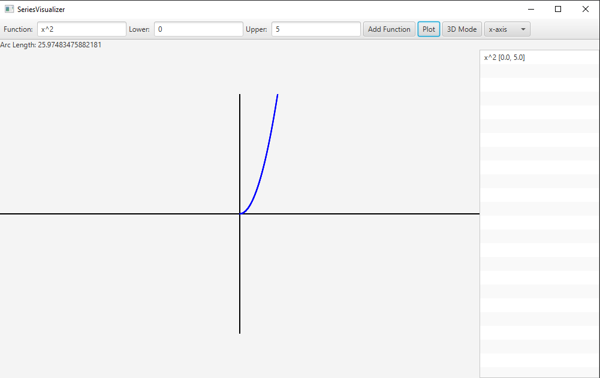

# SeriesVisualizer

## How to Use
1. **Input a Function:** Enter a mathematical expression (e.g., `x^2`, `sin(x)`) in the function input field.
2. **Set Bounds:** Specify the lower and upper bounds for the x-axis.
3. **Add Function:** Click **Add Function** to add it to the list.
4. **Plot the Function:** Click **Plot** to visualize the function:
   - **2D Mode:** View the function as a curve on the 2D plane.
   - **3D Mode:** Toggle 3D mode to see the function rotated along the selected axis.
5. **Arc Length Calculation:** The arc length for all functions is displayed at the bottom.
6. **View Functions:** All added functions are shown in a list on the right.
